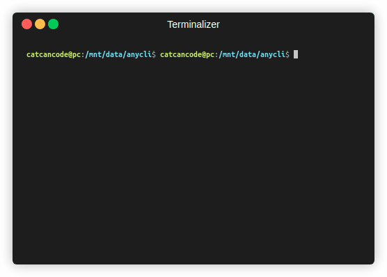

# anycli

`anycli` is a versatile Node.js package that allows you to quickly create command-line interfaces (CLIs) using a simple YAML configuration. It provides a straightforward way to define commands, options, and arguments for your CLI tool, making it easy to build custom command-line applications.

## Installation

You can install cat-anycli using npm:

```bash
npm install -g cat-anycli
```

## Usage
To create a CLI using AnyCLI, you need to define a YAML configuration file. Let's say you have a file named `./anycli.yaml` with the following content:

```yaml
- name: run
  type: list
  message: run command
  choices:
    - name: show list
      short: "run ls -l"
      value: ["ls"]
    - name: run git 
      short: "run git status"
      value: ["git", "status"]
```
Then run it with
```
anycli ./anycli.yaml
```
or
```
anycli
```



Enjoy!

